## Transport Protocols

1. **TCP** $\Rightarrow$ Transmission Control Protocol
2. **UDP** $\Rightarrow$ User Datagram Protocol 

What we basically have is a form of **logical communication** between the sender and receiver to achieve lossless data transmission on a noisy channel.

## Sender
 Breaks up the message into segments and adds necessary headers and then transmits them based on some algorithm and passes it to the Network Layer.

## Receiver
 Reassembles the segments into messages and check the header for stuff and demux the message onto approriate application layer socket.

This is what happens to send and receieve messages from 2 hosts, we implement this transport using either TCP or UDP.

## TCP
1. Reliable, in-order delivery
2. Congestion Control
3. Flow Control
4. Connection Setup

## UDP
1. Unreliable, un-ordered delivery 
2. Extension of **"best-effort"** IP

### Transport Layer Muxing and Demuxing
Literally just select shit.
1. Multiplexing at sender works by taking data from multiple sockets and transport headers.
2. Demultiplexing at receiver works by using header info to send recieved packages to correct sockets.

Datagrams have Source IP and ports and Destination IP and ports, as can be seen in the TCP/UDP segment format. The host uses these information to direct segment to appropriate segment.

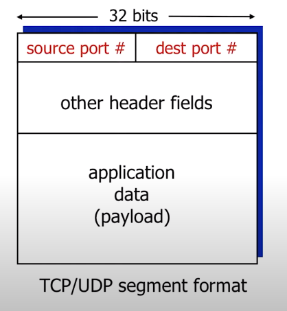

UDP $\Rightarrow$ needs a 2-tuple of the `Destination port` along with the `Source port` for the connectionless demuxing

TCP $\Rightarrow$ needs a 4-tuple of `Destination IP and Port` and `Source IP and Port` for the connection-oriented demuxing

## Connection-Less Transport UDP
UDP is defined in **RFC 768** which you can find [here](https://www.rfc-editor.org/rfc/rfc768)
1. No handshaking
2. Each segment handled differently 
3. "Best Effort"
4. No congestion control
5. Small header size

### Use-cases for UDP
1. Streaming Multimedia
2. DNS
3. SNMP
4. HTTP/3

Reliability and congestion control can be added in application layer if needed

**UDP HEADER IS 8 BYTES** (**IMPORTANT**)
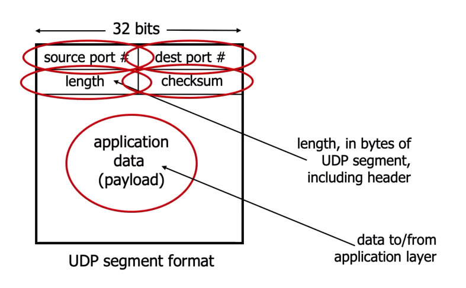

### UDP Checksum
Literally just the checksum, used to check 1-bit errors. UDP treats whole contents as 16-bit integers and then checksums on those.

## Reliable Data Transfer
Starting off with **rdt** short for reliable data transfer and **udt** for unreliable data transfer.

First `rdt_send()`, `udt_send()`, then `rdt_receive()` and finally `deliver_data()`.
First 2 work on host and last 2 on receiver.
**Control messages bi-directoinal but data flow only in one direction**

### rdt1.0
The finite state machine for rdt1.0 is as shown below for the sender and receiver:

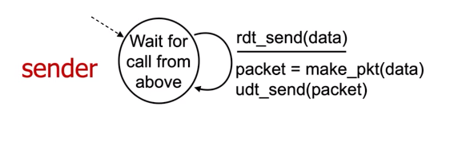
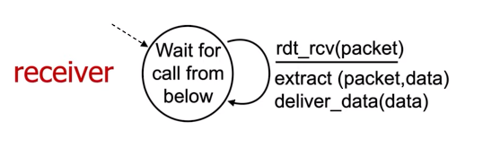

### rdt2.0
Now we try to recover from errors. To do this we introduce:
1. **ACKS** (Acknowledgements): Receiver explicitly tells the sender that the pkt has been received OK
2. **NAKS** (Negative Acknowledgements): Receiver explicitly tells the sender that the pkt had errors
3. Sender retransmits pkt in the case of a **NAK**

This is known as the **STOP AND WAIT PROTOCOL**

The Fsm for this is as below:

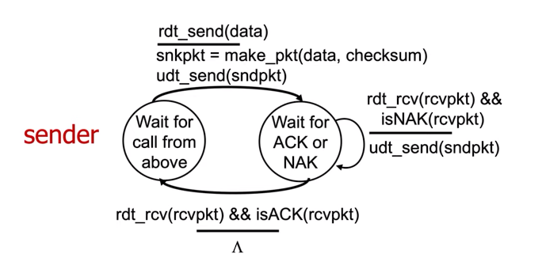

BUUUUUUUUUUUUUTTTT, **ACKS** and **NAKS** too can be corrupted so this is a flaw for rdt2.0 and we can't just retransmit **ACKS** and **NAKS** since this could bring up the issue of duplicate packets being sent.

### rdt2.1
This is basically **rdt2.0** but can handle erronous **ACKS** and **NAKS** by adding a sequence number to each packet so that when retransmitting the **ACKS** or **NAKS** we don't have duplicates.

The fsm's are as below:

`Sender:`
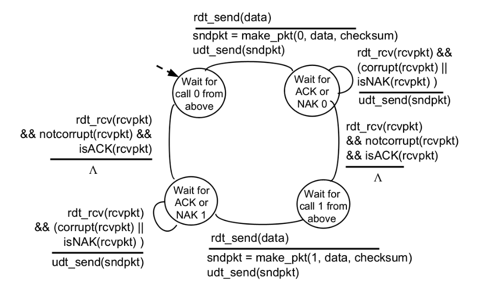
`Receiver:`
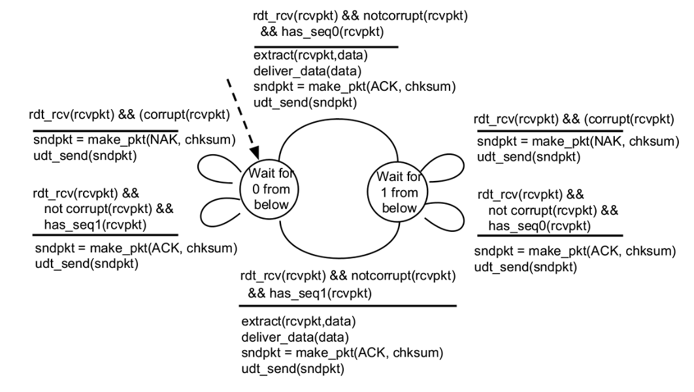

**ONLY ONE SEQ NO REQUIRED BECASUE STOP AND WAIT PROTOCOL SINCE ONLY 1 PACKET IS EVER IN TRANSMISSION**

### rdt2.2
Now we remove **NAKS** and thus our protocol will only have **ACKS**

Receiver will send **ACK** along with the seq no. of the packet being **ACKed**, what this changes is instead of checking for a **NAK** it will instead check for a **ACK** for the specific seq no, this basically works as a pseudo-**NAK**

### rdt3.0
Big leagues now boi, we can now handle channels with errors and loss. We achieve this by adding a reasonable timeout

1. Retransmit packet if no **ACK** received in time
2. if pkt or **ACK** is delayed
   1. Then retransmission will duplicate the pkt/**ACK** but seq no. gets rid of this issue
   2. receiver must specify seq no. being of packet being **ACKed**

The fsm for the receiver does not change, but for the sender there are new paths to follow for the timeout and new actions where we start and stop timers. 

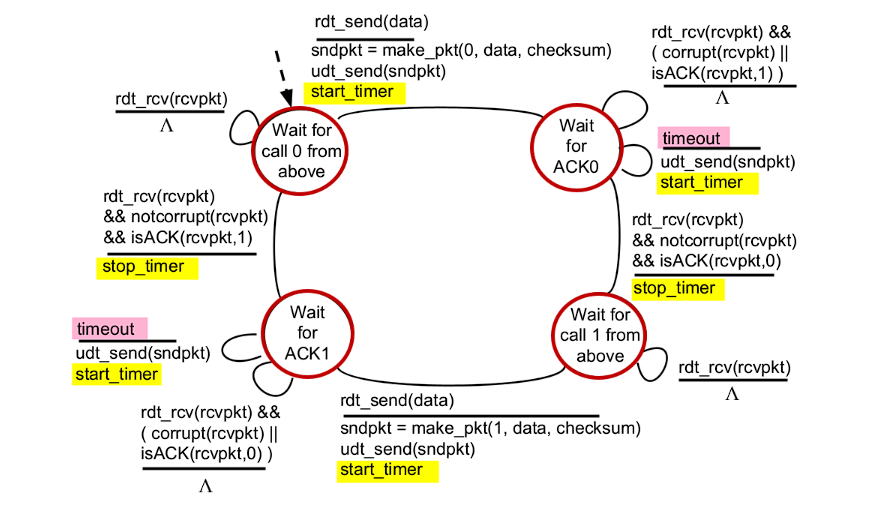

## Performance of Reliable Transfer Protocols
We define some terms:

$U_{sender}$ : `utilization`, i.e. the fraction of time sender is busy sending

$D_{trans}$ : `Transmission Delay`, which is nothing but $\frac{L}{R}$, where $L$ is packet size, and $R$ is the link speed.

$RTT$ : `Round Trip Time`

We have that:

$$U_{sender} = \frac{D_{trans}}{RTT + D_{trans}}$$

For a large RTT, the performance for this **STOP and WAIT** protocol is bad. But this is because we are waiting a long time for just 1 packet what we could instead do in the meanwhlie is send more packets specified in a certain window size, this is known as pipelinig.

But this requires more than 1-bit seq no. This is now implemented using the **GO-BACK-N** algorithm.

### GO-BACK-N 
What we do here is use a cumulative **ACK** where as the **cumulative** implies we check all **ACKs** for the window at once.

### Selective Repeat
Alternative to **GO-BACK-N** where receiver individually **ACKS** all packets, thus we need more timers, window doesn't move forward until oldest packet is **ACKED**
Selective Repeat could be bad since it might not recognize duplicates and not in-order delivery, so fix is seq_no. $\geq$ $2$ $\cdot$ window_size

## TCP Lesgoooo

[RFC 793](https://www.rfc-editor.org/rfc/rfc793)

[RFC 1122](https://www.rfc-editor.org/rfc/rfc1122)

[RFC 2018](https://www.rfc-editor.org/rfc/rfc2018)

[RFC 5681](https://www.rfc-editor.org/rfc/rfc5681)

[RFC 7323](https://www.rfc-editor.org/rfc/rfc7323)

Check these out if you want more info.

$MSS$ : maximum segment size

1. point-to-point
2. reliable, in-order byte stream
3. full-duplex
4. cumulative **ACKS**
5. pipelined
6. connection-oriented (Handshakes)
7. flow-controlled

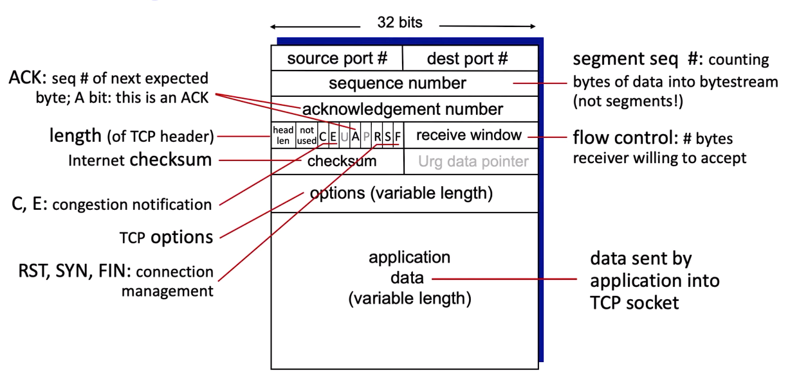

ACK for a bytestream is just the sequence number + 1 in tcp
    
### Figuring out timeouts
Need greater than **RTT** but **RTT** varies, fix how? Estimate RTT and change when needed

We take the exponentially weighted moving average for the estimatedRTT, thus we have:

$$EstimatedRTT = (1 - \alpha) \cdot EstimatedRTT + \alpha \cdot SampleRTT$$

Here $\alpha$ is our weight and is usually around $0.125$

But this is actually the timeout value, we need to add some sort of **safety margin**.

Thus adding that term in we have:

$$TimeoutInterval = EstimatedRTT + 4 \cdot DevRTT$$

where **DevRTT** is the deviation of sorts, it is the exponentially weighted moving average of the deviation of **SampleRTT** from the **EstimatedRTT**.

$$DevRTT = (1 - \beta) \cdot DevRTT + \beta \cdot |SampleRTT - EstimatedRTT|$$

where $\beta = 0.25$ usually.

Some events that are probably important for TCP:

### Event : Data Received from App
1. create segment with a seg no.
2. seg no. is byte-stream number
3. start timer if not already running

### Event : timeout
1. retransmit segment caused timeout
2. restart timer

### Event : ACK received
1. ACK acknowledges previously unACKED segments? then update ACKed stuff and start timer if there are still unACKed segments

This is stuff for the sender side, on the receiving side:

### ACK Generation
1. Arrival of in-order seg with expect seq no, all data upto expected seq no. already **ACKed** then $\Rightarrow$ Delayed **ACK**
2. Arrival of in-order seg with expect seq no, one other seg has **ACK** pending $\Rightarrow$ immediately send out single Cumulative **ACK**
3. Arrival of out-of-order seg with higher than expected seq no, i.e. a gap $\Rightarrow$ immediately send duplicate **ACK** indicating seq no of next expected byte
4. arrival of segment that partially or completely fills gap $\Rightarrow$ immediately send **ACK** provided that segment starts at lower end of the gap

### TCP fast retransmit
Basically sends the same **ACK** multiple times when sender sees this it retransmits oldest **unACKed** segment once again

There is also the idea of timeouts where we send all the packets in the window again instead of just 1.  

## TCP Congestion Control

### AIMD (additive-increase/multiplicative-decrease)
1. Additive Increase $\Rightarrow$ Increases by 1 MSS
2. Multiplicative Decrease $\Rightarrow$ Decreases by half
   1. For TCP tahoe it cuts to 1 MSS
   2. Halfed for TCP Reno

The congestion window is dynamically adjusted to fit, in response to the observed network congestion.

TCP sending behaviour:
* **roughly**: send cwnd bytes of data and wait RTT for ACKS then:
   $$TCP\ rate = \frac{cwnd}{RTT}\ \ bytes/second$$

### TCP Slow start
* When connection begins increase rate exponentially until the first loss event
  * Initially $cwnd = 1\ MSS$
  * double $cwnd$ every RTT
  * done by incrementing cwnd for every ACK received

### ssthresh
Slow start threshold, on loss event it gets set to $\frac{1}{2}cwnd$.

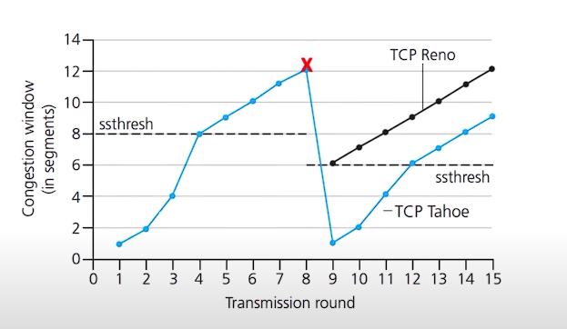

The finite state machine for TCP congestion control is as below:

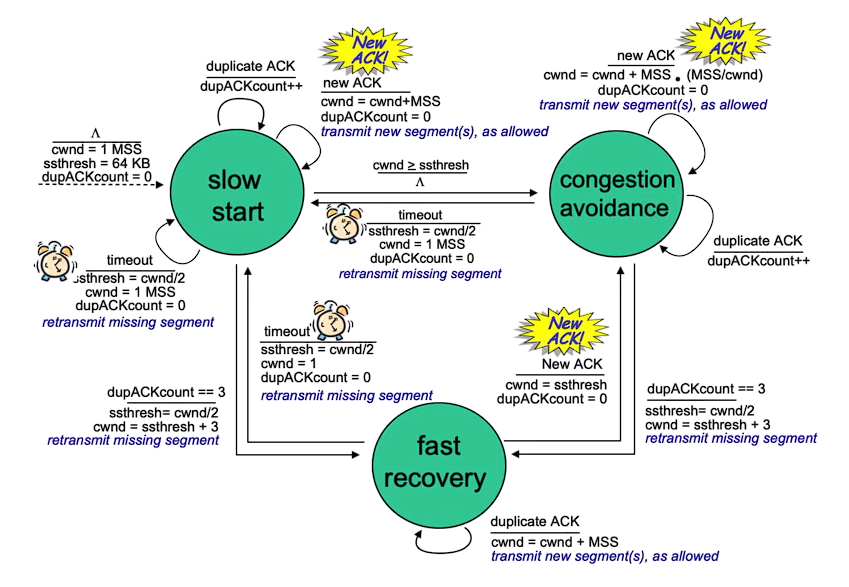

## TCP Cubic
* The main idea here is that after loss the congestion window shouldn't have changed all that much
* Therefore we can quickly increase till we get close to the congestion window and then slow down the increase to even it out.
* This enables a higher throughput on average than with AIMD

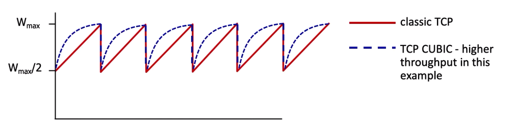

Steps for the cubic algorithm:
* K: Point in time when TCP window size will reach $W_{max}$, K itself is tuneable
* increase W as a function of the cube of its distance between the current time and K 
  * larger increases when further away from K
  * smaller increases (catious) when nearer K

### Delay Based Approach
* $RTT_{min}$ is the minimum observed throughput 
* Measured Throughput is $\frac{bytes\ sent\ in\ last\ RTT\ interval}{RTT_{measured}}$
* The uncongested throughput is therefore $\frac{cwnd}{RTT_{min}}$
* If the measured throughput very close to uncongested throughput
  * Increase cwnd linearly
* else measured throughput far below uncongested throughput
  * Decrease cwnd linearly

Recent version of TCP called BBR (Bottleneck-Bandwidth-RTT) used in google's internal backbone network.

### Explicit congestion notification
Eishob baal nai