## Network Layer Services and protocols
There are network layer protocols in every internet device, i.e. hosts and routers

### Routers
* Examines the header fields in all IP datagrams passing through it 
* Moves datagrams from input ports to output ports to transfer datagrams along end-end path

Network Layer Functions
* **forwarding:** moving packets from a router's input link to appropriate router output link
* **routing:** determine route taken by packets from source to destination
  * routing algos(chapter 5 lol)

## Data Plane
* **Local**, per-router function
* determine how datagram arrives on router input port and is forwared to output port

## Control Plane
* Determines how datagram is routed among routers along end-end path from source host to dest-host
* two control-plane approaches
  * traditional routing algos
  * SDNs (Software defined networking)

Eishob baal chapter 5 e pore dekhte hobe

### Network Service Model
* Guaranteed delivery with constant delay
* Guaranteed in-order delivery with higher bandwidth

Internet uses **Best effort** service.

No guarantees on:
* successful datagram delivery
* timing or order of delivery
* bandwith available to end-end flow

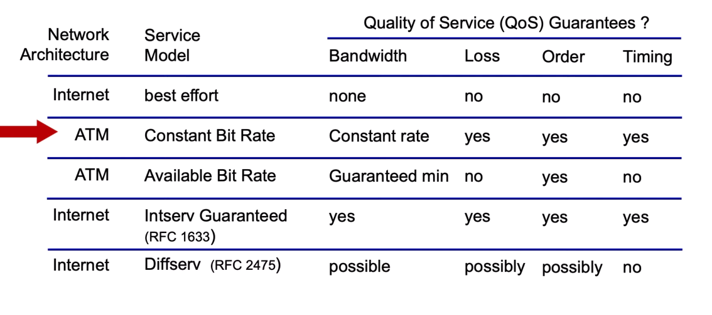

## Forwarding

We go from input ports to output ports through the **Switching Fabric**, routers also have router processors that perform control plane functions.

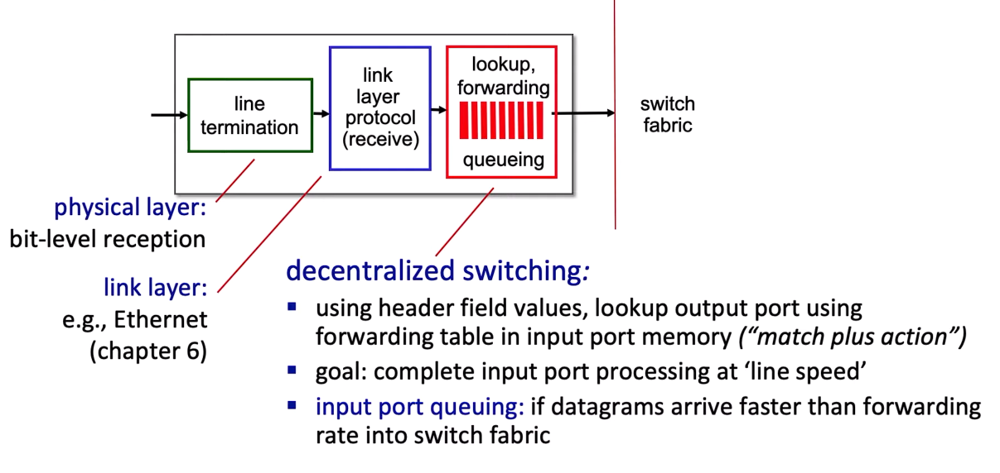

### Destination based Forwarding
Router table entries are aggregated into different ranges, i.e. values from $x-y$ go to a certain link interface and so on. If ranges don't divide up nicely? WE PAD MY BRUTHA.

Also since we only know the ranges how to divy up packets into the range? we want to do this pretty fast. What we can do here is use Longest Prefix Matching (Literally all it does)

### Longest Prefix Matching
We build routing tables on the prefixes instead of ranges. Allowing us to use fast algorithms to find out which prefix is being matched and thus finding the required link interface.

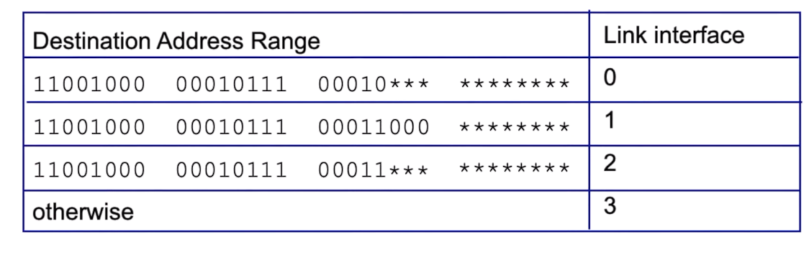

Longest prefix matching is done by using ternary content addressable memories (TCAMs)
* **content addressable:** 
* Cisco Catalyst

### Switching Fabric
**swtiching rate:** Maximum rate the packets can be moved input to output, ideally $N\cdot R$
**Blocking:** Packets have to wait their turn
**Non-Blocking:** Free for all, jar ja khusi

There are 3 major types of switching:
* Memory
* Bus
* Interconnection Network

### Memory
First Gen routers used Memory Switching, the speed was limited by the memory bandwidth

### Bus
* Datagram from input port memory to output port memory via a shared bus
* **Bus connection:** switching speed limited by bus bandwidth

### Interconnection Networks
Literally Data-comm shit
* Crossbar
* Clos Networks (Multistage switching networks)

Lots of parallelism here too.

## Input Port Queuing
* If switch fabric slower than input ports combined $\Rightarrow$ queueing may occur at input queues 
  * Queuing delay and loss due to input buffer overflow
* **Head-of-the-Line (HOL)** blocking: queued datagram at front of queue prevents others in queue from moving forward

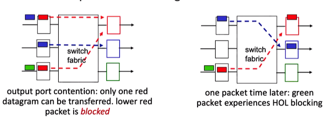

### Output port queuing
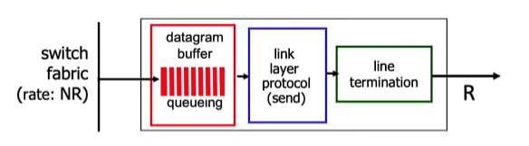

* **Buffering** required when datagrams arrive from fabric faster than transmission rate, packets dropped if buffer full

* **Scheduling Discipline** chooses among queued datagrams for transmission

Large buffers bad, [RFC 3429](https://www.rfc-editor.org/rfc/rfc3439) this says $RTT \cdot C$

Most recent stuff says it should be:
$\frac{RTT \cdot C}{\sqrt{N}}$

Too much buffering bad because:
* Long RTTs
* Delay based congestion control : "Keep bottleneck link just full enough (busy) but no fuller"

### Buffer Management
Think of buffer as queue.

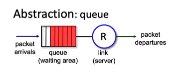

* **drop**: which packets to add, drop when buffer is full
  * **tail drop**: drop arriving packet
  * **priority**: drop/remove on priority basis
* **marking**: which packets mark to signal congestion (ECN, RED)

### Packet Scheduling
* **First Come First served**: only 1 queue
* **Priority**: Has low and high priority queue
* **Round robin**: queue for every class
* **Weighted fair queueing**: form of round robin, it differs from round-robin in that it can be give different classes different weights depending on the time

## IP datagram

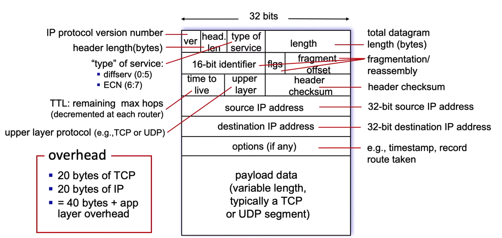

* **IP address:** 32 bit identifier associated with each host or router interface

### Subnets
* Devices that are directly connected to each other
* Ip network made up of multiple subnets
* Subnet mask provides how many same mask values they will have in the ip address

### CIDR (Classless InterDomain Routing)
* Subnet portion of address of arbitrary length
* address format: a.b.c.d/x where x is the # of bits in the subnet portion of address, last d ommitted if 0

### DHCP (Dynamic Host Configuration Protocol)
Dynamically get address from a server, is plug and play.

Host will dynimcally obtains IP address from network server when it "joins" the network
* can renew its lease on address in use
* allows reuse of address (only hold address while connected/on)
* support for mobile users who join/leave network

**OVERVIEW**
* Host broadcasts **DHCP discover** msg
* DHCP server responds with **DHCP offer** msg
* host requests IP address: **DHCP request**
* DHCP server sends address: **DHCP ack** msg

DHCP server co-located inside router usually.

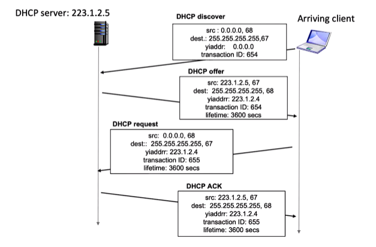

DHCP also returns more info than an IP, which are as follows:
* Address of first-hop router for client
* name and IP address of DNS server
* network mask

**ICANN** world boss right here.

### NAT (Network Address Translation)
Everyone uses same IP address for connection to the internet, but will be differentiated by local ips.

* All devices in local network have 32-bit addressesin a "private" IP address space (10/8, 172.16/12, 192.168/16 prefixes) that can only be used in local network

Advantages:
* Just one IP address needed from provider ISP for all devies
* can change address of host in local netwrok without notifying outside world
* can change ISP without changing address of devies in local network
* security: device inside local net not direcly addressable, visible to the outside world

### Implementation of NAT
* Outgoing datagrams: replace(source IP, port #) of every outgoing datagram to (NAT IP addr, net port #)
* remember every translation pair
* incoming datagrams: replace like with outgoing but opposite

But NAT controversial 
* routers "should" only process upto layer 3
* address "shortage" should be solved IPv6
* violates end-end argument
* NAT traversal, what if client wants to connect to server behind NAT

## IPv6
* FIXED LENGTH HEADER OMG
* Speed more
* enable different network-layer flows

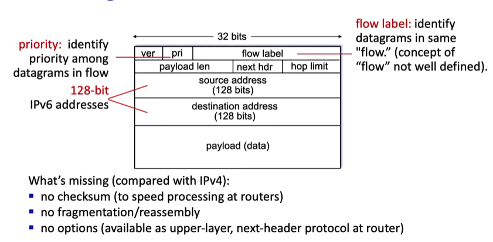

### How to transition?
We want them to coexist really. Fix? Tunneling

**tunneling**: IPv6 Datagram carried as payload in IPv4 datagram among IPv4 routers

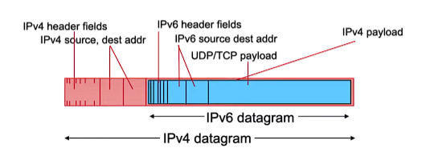

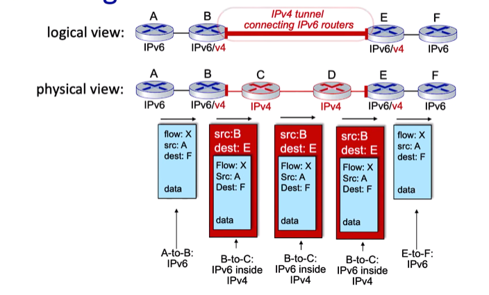

## Generalized Forwarding
